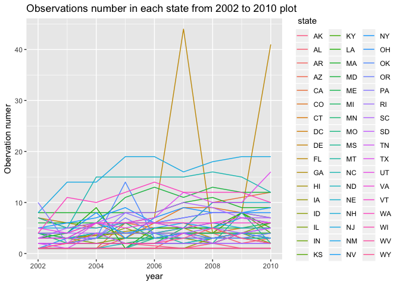
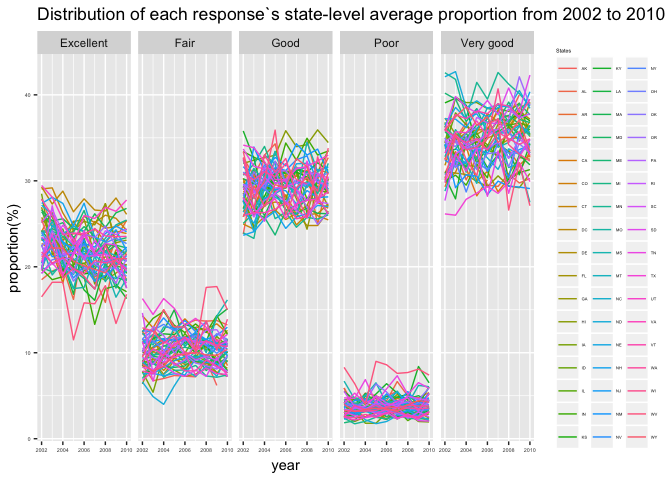
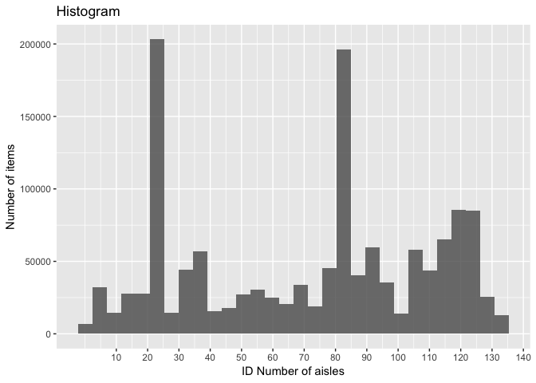

p8105\_hw3\_xw2598
================
Xinyao Wu
2018-10-05

problem1
========

``` r
#build a dataset
devtools::install_github("p8105/p8105.datasets")
```

    ## Skipping install of 'p8105.datasets' from a github remote, the SHA1 (21f5ad1c) has not changed since last install.
    ##   Use `force = TRUE` to force installation

``` r
library(p8105.datasets)
library(tidyverse)
```

    ## -- Attaching packages ------------------------------------------------------- tidyverse 1.2.1 --

    ## v ggplot2 3.0.0     v purrr   0.2.5
    ## v tibble  1.4.2     v dplyr   0.7.6
    ## v tidyr   0.8.1     v stringr 1.3.1
    ## v readr   1.1.1     v forcats 0.3.0

    ## -- Conflicts ---------------------------------------------------------- tidyverse_conflicts() --
    ## x dplyr::filter() masks stats::filter()
    ## x dplyr::lag()    masks stats::lag()

``` r
library(ggridges)
```

    ## 
    ## Attaching package: 'ggridges'

    ## The following object is masked from 'package:ggplot2':
    ## 
    ##     scale_discrete_manual

``` r
data(brfss_smart2010)
brfss = brfss_smart2010 %>% 
#data cleaning
#rename variables
  janitor::clean_names() %>% 
#focus on the “Overall Health” topic
  filter(topic == "Overall Health") %>% 
#include only responses from “Excellent” to “Poor”  (1)???
  select(year,locationabbr,locationdesc,response,data_value) %>% 
#organize responses as a factor
  mutate(
    response = factor(response)
  )
head(brfss, 10)
```

    ## # A tibble: 10 x 5
    ##     year locationabbr locationdesc          response  data_value
    ##    <int> <chr>        <chr>                 <fct>          <dbl>
    ##  1  2010 AL           AL - Jefferson County Excellent       18.9
    ##  2  2010 AL           AL - Jefferson County Very good       30  
    ##  3  2010 AL           AL - Jefferson County Good            33.1
    ##  4  2010 AL           AL - Jefferson County Fair            12.5
    ##  5  2010 AL           AL - Jefferson County Poor             5.5
    ##  6  2010 AL           AL - Mobile County    Excellent       15.6
    ##  7  2010 AL           AL - Mobile County    Very good       31.3
    ##  8  2010 AL           AL - Mobile County    Good            31.2
    ##  9  2010 AL           AL - Mobile County    Fair            15.5
    ## 10  2010 AL           AL - Mobile County    Poor             6.4

``` r
#In 2002, which states were observed at 7 locations
loc_brfss = brfss %>% 
  group_by(year,locationabbr) %>% 
  summarise(
    count = n_distinct(locationdesc)
    )
  filter(loc_brfss,count == 7,year == 2002)
```

    ## # A tibble: 3 x 3
    ## # Groups:   year [1]
    ##    year locationabbr count
    ##   <int> <chr>        <int>
    ## 1  2002 CT               7
    ## 2  2002 FL               7
    ## 3  2002 NC               7

Comments: In 2002,CT,FL,NC were observed at 7 locations. I choose distinct specific locations which were observed in each state as the dataset, because from the original data each specific location were repetitive and the repetity doesn\`t make sence in this question.

``` r
#spaghetti plot
ggplot(loc_brfss, aes(x = year, y = count, fill = locationabbr,color = locationabbr))+
  geom_line() +
  labs(
    title = "Observations number in each state from 2002 to 2010 plot",
    x = "year",
    y = "Obervation numer"
  )+
  scale_color_hue(name = " state", h = c(0,360))
```



Comments: Since the number of states is large, each state line is difficult to be distinguished. But the tendency for most of the observation number in each state is clear, which seems stable.For example, NY always has more observation counts than other states.And, only few states like FL seems to have huge waves in 2002-2010.It seemed like FL had a weird high observation count in 2007 and 2010. Meanwhile, differences between states\` observation numbers are also stable, seen from this plot.

``` r
# For the years 2002, 2006, and 2010, the mean and standard deviation of the proportion of “Excellent” responses across locations in NY State
ny_brfss = brfss %>% 
  ungroup() %>% 
  filter(year %in% c(2002,2006,2010) & locationabbr == "NY" & response == "Excellent") %>% 
  group_by(locationdesc) %>% 
  summarise(
  mean = mean(data_value, na.rm = TRUE),
  sd = sd(data_value, na.rm = TRUE) 
 ) 
  ny_brfss
```

    ## # A tibble: 9 x 3
    ##   locationdesc             mean     sd
    ##   <chr>                   <dbl>  <dbl>
    ## 1 NY - Bronx County        17.6 NA    
    ## 2 NY - Erie County         17.2 NA    
    ## 3 NY - Kings County        20.4  1.77 
    ## 4 NY - Monroe County       22.4 NA    
    ## 5 NY - Nassau County       24.9  2.82 
    ## 6 NY - New York County     27.5  1.54 
    ## 7 NY - Queens County       19.6  1.36 
    ## 8 NY - Suffolk County      24.1  3.28 
    ## 9 NY - Westchester County  26.4  0.636

Comments: During 2002,2006,2010 in NY, the Westchester County and New York County had high "excellent" proportion with the low sd value compared with other counties. Most counties have an "excellent" proportion higher than 20 except Erie County, Bronx County and Queens County. In sd column there are 3 NA value, which is because the related county only were observed only once in specific years(2002,2006,2010).

``` r
#For each year and state,compute the average proportion in each response category
tl_brfss = brfss %>% 
  group_by(year, locationabbr, response) %>% 
  summarise(
    averange = mean(data_value)
  )
#make a five-panel plot
ggplot(tl_brfss,aes(x = year, y = averange, fill = locationabbr, color = locationabbr))+
  geom_line()+
  facet_grid(. ~ response)+
  labs(
    title = "Distribution of each response`s state-level average proportion from 2002 to 2010",
      x = "year",
      y = "proportion(%)",
      color = "States"
  )+
  theme(axis.text = element_text(size = 4),
        legend.title = element_text(size = 4),
        legend.text = element_text(size = 3)
        )
```

    ## Warning: Removed 2 rows containing missing values (geom_path).

 Comments:This plot shows (1)in each panel(response category),the differences between most state-level proportion averages keep within 10%. (2)Obvious differences between different panels, which shows a overall tendency for all states that the percentages of responses are arranged in descending order :"Very good" &gt;"good" &gt;"Excellent" &gt;"Fair" &gt;"Poor".

problem 2
---------

``` r
#load data
library(p8105.datasets)
data(instacart)
nrow(instacart)
```

    ## [1] 1384617

``` r
ncol(instacart)
```

    ## [1] 15

``` r
#This is a 1384617 rows * 15 cols dataset which indicates the information of costomers` order details and their products` details. 
#The key variables include days_since_prior_order, aisle_id, department_id and so on.
#For example,in var 'days_since_prior_order', each value means the gap days from this costomer`s last order to this one. The var 'department_id' shows which departments each product belong to, which can be studied to explore which departments is most sold.
```

``` r
#how many aisles are there, and which aisles are the most items ordered from?
nrow(distinct(instacart, aisle))
```

    ## [1] 134

``` r
instacart %>% 
  count(aisle) %>% 
  arrange(n) %>% 
  tail()
```

    ## # A tibble: 6 x 2
    ##   aisle                              n
    ##   <chr>                          <int>
    ## 1 water seltzer sparkling water  36617
    ## 2 packaged cheese                41699
    ## 3 yogurt                         55240
    ## 4 packaged vegetables fruits     78493
    ## 5 fresh fruits                  150473
    ## 6 fresh vegetables              150609

``` r
#Make a plot that shows the number of items ordered in each aisle.
instacart %>% 
  select(product_id,product_name,aisle_id,aisle) %>%  
  ggplot(aes(x = aisle_id))+geom_histogram(alpha = .8)+
  labs(
    title = "Histogram",
    x = "ID Number of aisles",
    y = "Number of items"
  )+
  scale_x_continuous(
    breaks = c(10,20,30,40,50,60,70,80,90,100,110,120,130,140),
    labels = c(10,20,30,40,50,60,70,80,90,100,110,120,130,140)
  )
```

    ## `stat_bin()` using `bins = 30`. Pick better value with `binwidth`.



``` r
#Make a table showing the most popular item aisles “baking ingredients”, “dog food care”, and “packaged vegetables fruits”
bak_in = instacart %>% 
  select(product_id,product_name,aisle_id,aisle) %>%  
  filter(aisle == "baking ingredients") %>%  
   group_by(aisle,product_name) %>% 
   summarise( n = n()) %>% 
   arrange(n) %>% 
   tail(1)
dog_f = instacart %>% 
  select(product_id,product_name,aisle_id,aisle) %>%  
  filter(aisle == "dog food care") %>%  
   group_by(aisle,product_name) %>% 
   summarise( n = n()) %>% 
   arrange(n) %>% 
   tail(1)
pac_v = instacart %>% 
  select(product_id,product_name,aisle_id,aisle) %>%  
  filter(aisle == "packaged vegetables fruits") %>%  
   group_by(aisle,product_name) %>% 
   summarise( n = n()) %>% 
   arrange(n) %>% 
   tail(1)
table_popular_item = tibble(
  aisle = c("baking ingredients","dog food care","packaged vegetables fruits"),
  most_popular_item = c("Light Brown Sugar", "Snack Sticks Chicken & Rice Recipe Dog Treats","Organic Baby Spinach")
)
table_popular_item
```

    ## # A tibble: 3 x 2
    ##   aisle                      most_popular_item                            
    ##   <chr>                      <chr>                                        
    ## 1 baking ingredients         Light Brown Sugar                            
    ## 2 dog food care              Snack Sticks Chicken & Rice Recipe Dog Treats
    ## 3 packaged vegetables fruits Organic Baby Spinach

``` r
#Make a table showing the mean hour of the day at which Pink Lady Apples and Coffee Ice Cream are ordered on each day of the week;
table_mean_hour = instacart %>% 
  filter(product_name == "Pink Lady Apples"|product_name == "Coffee Ice Cream") %>% 
  select(order_dow, product_name, order_hour_of_day) %>% 
  group_by(product_name,order_dow) %>% 
  summarise(mean_hour = mean(order_hour_of_day, na.rm = TRUE)) %>% 
  spread(key = order_dow, value = mean_hour) 
  table_mean_hour
```

    ## # A tibble: 2 x 8
    ## # Groups:   product_name [2]
    ##   product_name       `0`   `1`   `2`   `3`   `4`   `5`   `6`
    ##   <chr>            <dbl> <dbl> <dbl> <dbl> <dbl> <dbl> <dbl>
    ## 1 Coffee Ice Cream  13.8  14.3  15.4  15.3  15.2  12.3  13.8
    ## 2 Pink Lady Apples  13.4  11.4  11.7  14.2  11.6  12.8  11.9

Comments: (1)There are 134 aisles, and the fresh vegetables is the most items ordered from. (2)The Histogram shows roughly that two aisles have obviously more items than others and their id is between 20-25 and 80-85.Apart from this, we can see the distribution of the item numbers in each aisle arranged by their id number.
(3)The most popular item in aisles “baking ingredients”, “dog food care”, and “packaged vegetables fruits” is repectively "Light Brown Sugar", "Snack Sticks Chicken & Rice Recipe Dog Treats", "Organic Baby Spinach" (4)Except Sunday and Friday, Pink Lady Apples orderred mean hour is obviously smaller than that of Coffee Ice Cream. Also, Pink Lady Apples were orderred at noon in most of the day but Coffee Ice Cream were orderred in the afternoon at most times.

problem3
--------

``` r
data(ny_noaa)
ncol(ny_noaa)
```

    ## [1] 7

``` r
nrow(ny_noaa)
```

    ## [1] 2595176

``` r
arrange(ny_noaa,date) %>% head(1)
```

    ## # A tibble: 1 x 7
    ##   id          date        prcp  snow  snwd tmax  tmin 
    ##   <chr>       <date>     <int> <int> <int> <chr> <chr>
    ## 1 USC00300023 1981-01-01     0     0     0 -56   <NA>

``` r
arrange(ny_noaa,date) %>% tail(1)
```

    ## # A tibble: 1 x 7
    ##   id          date        prcp  snow  snwd tmax  tmin 
    ##   <chr>       <date>     <int> <int> <int> <chr> <chr>
    ## 1 USW00094790 2010-12-31     0    NA    NA 117   44

``` r
nrow(na.omit(select(ny_noaa,tmax,tmin)))/nrow(ny_noaa)
```

    ## [1] 0.5621584

``` r
nrow(na.omit(select(ny_noaa,prcp)))/nrow(ny_noaa)
```

    ## [1] 0.9438042

``` r
nrow(na.omit(select(ny_noaa,snow)))/nrow(ny_noaa)
```

    ## [1] 0.853104

``` r
nrow(na.omit(select(ny_noaa,snwd)))/nrow(ny_noaa)
```

    ## [1] 0.7719669

This is a 2595176 rows \* 7 cols dataset which indicates the New York weather information from 1981-01-01 to 2010-12-31, such as precipitation,Snowfall,Snow depth, Maximum and minimum temperature, which were collected by New York state weather stations characterized by id number.

key varibales:'prcp' indicates precipitation,'snow' indicates Snowfall,'snwd' denotes Snow depth, 'tmax' and 'tmin' respectively denotes Maximum and minimum temperature. The missing value of 'tmax' and 'tmin' took 56% of total, so this became a serious issue. Beside this, the proportions of missing values of 'prcp','snow','snwd' were respectively 0.94,0.85,0.77.

``` r
new_noaa = ny_noaa %>% 
#data cleaning
 janitor::clean_names() %>% 
#Create separate variables for year, month, and day
 separate(date, into = c("year","month","day"),sep = "-") 
#Ensure observations for temperature, precipitation, and snowfall are given in reasonable units
 new_noaa$tmax = as.numeric(new_noaa$tmax)/10
 new_noaa$tmin = as.numeric(new_noaa$tmin)/10
 new_noaa$prcp = as.numeric(new_noaa$prcp)/10
# snowfall 
 new_noaa %>% 
   na.omit(.$snow) %>% 
   count(.$snow) %>%
   arrange(.,n) %>%
   tail()
```

    ## # A tibble: 6 x 2
    ##   `.$snow`       n
    ##      <int>   <int>
    ## 1        8    5380
    ## 2        5    5669
    ## 3       51    9252
    ## 4       13   12460
    ## 5       25   15809
    ## 6        0 1112758

Comments:

(1)For snowfall, 0 is the most commonly observed values. Because in summer,spring,autumn there is no snowfall and each observation of this dataset is counted by day. So the most observed value means the largest number of days this value was collected, that is why 0 is the most.

``` r
#Make a two-panel plot
  new_noaa %>% 
  filter(month == '01'|month == '07') %>% 
   group_by(year,month) %>% 
   summarise(
   averange = mean(tmax,na.rm = TRUE)
   ) %>% 
   ggplot(aes(x = as.numeric(year),y = averange,color = month))+
     geom_point()+
  geom_smooth(se = FALSE)+
   labs(
      x = "Year",
      y = "Average Max Temperature",
      color = "month"
  )+
  theme(axis.text = element_text(size = 3))+
     facet_grid(. ~ month)
```

    ## `geom_smooth()` using method = 'loess' and formula 'y ~ x'


Make a two-panel plot showing the average max temperature in January and in July in each station across years. Is there any observable / interpretable structure? Any outliers?

Make a two-panel plot showing (i) tmax vs tmin for the full dataset (note that a scatterplot may not be the best option); and (ii) make a plot showing the distribution of snowfall values greater than 0 and less than 100 separately by year.
