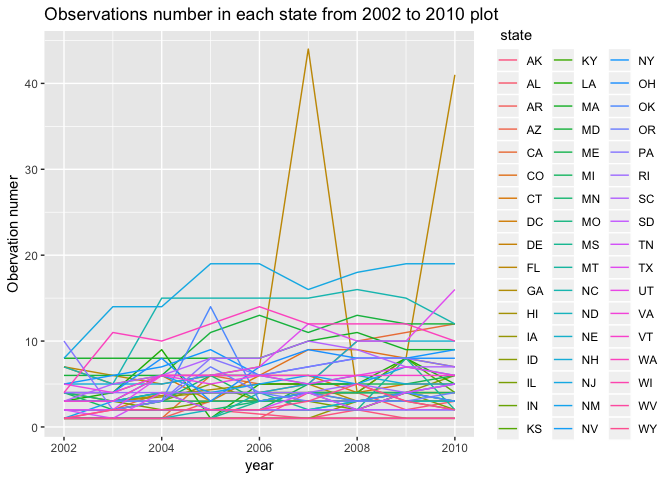
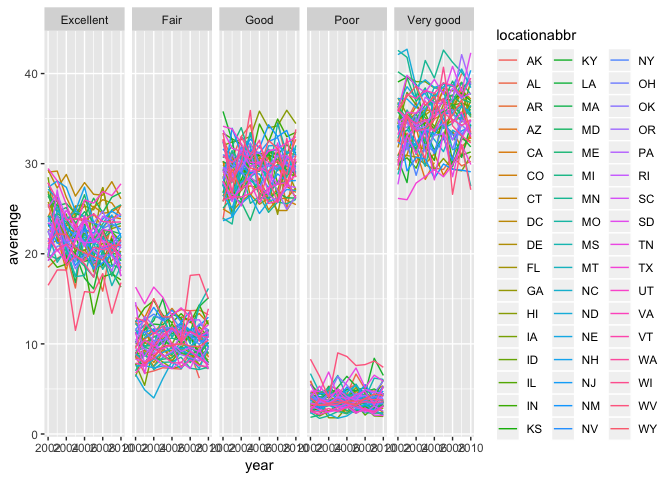

p8105\_hw3\_xw2598
================
Xinyao Wu
2018-10-05

problem1
--------

``` r
#build a dataset
devtools::install_github("p8105/p8105.datasets")
```

    ## Skipping install of 'p8105.datasets' from a github remote, the SHA1 (21f5ad1c) has not changed since last install.
    ##   Use `force = TRUE` to force installation

``` r
library(p8105.datasets)
library(tidyverse)
```

    ## ─ Attaching packages ─────────────────────────── tidyverse 1.2.1 ─

    ## ✔ ggplot2 3.0.0     ✔ purrr   0.2.5
    ## ✔ tibble  1.4.2     ✔ dplyr   0.7.6
    ## ✔ tidyr   0.8.1     ✔ stringr 1.3.1
    ## ✔ readr   1.1.1     ✔ forcats 0.3.0

    ## ─ Conflicts ──────────────────────────── tidyverse_conflicts() ─
    ## ✖ dplyr::filter() masks stats::filter()
    ## ✖ dplyr::lag()    masks stats::lag()

``` r
library(ggridges)
```

    ## 
    ## Attaching package: 'ggridges'

    ## The following object is masked from 'package:ggplot2':
    ## 
    ##     scale_discrete_manual

``` r
data(brfss_smart2010)
brfss = brfss_smart2010 %>% 
#data cleaning
#rename variables
  janitor::clean_names() %>% 
#focus on the “Overall Health” topic
  filter(topic == "Overall Health") %>% 
#include only responses from “Excellent” to “Poor”  (1)???
  select(year,locationabbr,locationdesc,response,data_value) %>% 
#organize responses as a factor
  mutate(
    response = factor(response)
  )
head(brfss, 10)
```

    ## # A tibble: 10 x 5
    ##     year locationabbr locationdesc          response  data_value
    ##    <int> <chr>        <chr>                 <fct>          <dbl>
    ##  1  2010 AL           AL - Jefferson County Excellent       18.9
    ##  2  2010 AL           AL - Jefferson County Very good       30  
    ##  3  2010 AL           AL - Jefferson County Good            33.1
    ##  4  2010 AL           AL - Jefferson County Fair            12.5
    ##  5  2010 AL           AL - Jefferson County Poor             5.5
    ##  6  2010 AL           AL - Mobile County    Excellent       15.6
    ##  7  2010 AL           AL - Mobile County    Very good       31.3
    ##  8  2010 AL           AL - Mobile County    Good            31.2
    ##  9  2010 AL           AL - Mobile County    Fair            15.5
    ## 10  2010 AL           AL - Mobile County    Poor             6.4

``` r
#In 2002, which states were observed at 7 locations
loc_brfss = brfss %>% 
  group_by(year,locationabbr) %>% 
  summarise(
    count = n_distinct(locationdesc)
    )
  filter(loc_brfss,count == 7,year == 2002)
```

    ## # A tibble: 3 x 3
    ## # Groups:   year [1]
    ##    year locationabbr count
    ##   <int> <chr>        <int>
    ## 1  2002 CT               7
    ## 2  2002 FL               7
    ## 3  2002 NC               7

Comments: In 2002,CT,FL,NC were observed at 7 locations. I choose distinct specific locations which were observed in each state as the dataset, because from the original data each specific location were repetitive and the repetity doesn\`t make sence in this question.

``` r
#spaghetti plot
ggplot(loc_brfss, aes(x = year, y = count, fill = locationabbr,color = locationabbr))+
  geom_line() +
  labs(
    title = "Observations number in each state from 2002 to 2010 plot",
    x = "year",
    y = "Obervation numer"
  )+
  scale_color_hue(name = " state", h = c(0,360))
```



Comments: Since the number of states is large, each state line is difficult to be distinguished. But the tendency for most of the observation number in each state is clear, which seems stable.For example, NY always has more observation counts than other states.And, only few states like FL seems to have huge waves in 2002-2010.It seemed like FL had a weird high observation count in 2007 and 2010. Meanwhile, differences between states\` observation numbers are also stable, seen from this plot.

``` r
# For the years 2002, 2006, and 2010, the mean and standard deviation of the proportion of “Excellent” responses across locations in NY State
ny_brfss = brfss %>% 
  ungroup() %>% 
  filter(year %in% c(2002,2006,2010) & locationabbr == "NY" & response == "Excellent") %>% 
  group_by(locationdesc) %>% 
  summarise(
  mean = mean(data_value, na.rm = TRUE),
  sd = sd(data_value, na.rm = TRUE) 
 ) 
  ny_brfss
```

    ## # A tibble: 9 x 3
    ##   locationdesc             mean     sd
    ##   <chr>                   <dbl>  <dbl>
    ## 1 NY - Bronx County        17.6 NA    
    ## 2 NY - Erie County         17.2 NA    
    ## 3 NY - Kings County        20.4  1.77 
    ## 4 NY - Monroe County       22.4 NA    
    ## 5 NY - Nassau County       24.9  2.82 
    ## 6 NY - New York County     27.5  1.54 
    ## 7 NY - Queens County       19.6  1.36 
    ## 8 NY - Suffolk County      24.1  3.28 
    ## 9 NY - Westchester County  26.4  0.636

Comments: During 2002,2006,2010 in NY, the Westchester County and New York County had high "excellent" proportion with the low sd value compared with other counties. Most counties have an "excellent" proportion higher than 20 except Erie County, Bronx County and Queens County. In sd column there are 3 NA value, which is because the related county only were observed only once in specific years(2002,2006,2010).

``` r
#For each year and state,compute the average proportion in each response category
tl_brfss = brfss %>% 
  group_by(year, locationabbr, response) %>% 
  summarise(
    averange = mean(data_value)
  )
#make a five-panel plot
ggplot(tl_brfss,aes(x = year, y = averange, fill = locationabbr, color = locationabbr))+
  geom_line()+
  facet_grid(. ~ response)
```

    ## Warning: Removed 2 rows containing missing values (geom_path).



For each year and state, compute the average proportion in each response category (taking the average across locations in a state).Make a five-panel plot that shows, for each response category separately, the distribution of these state-level averages over time.
